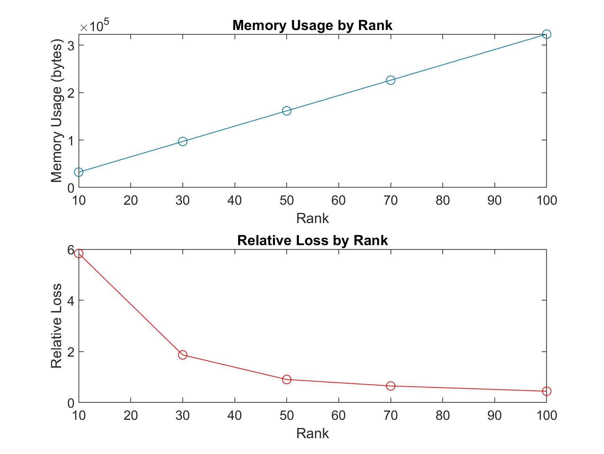
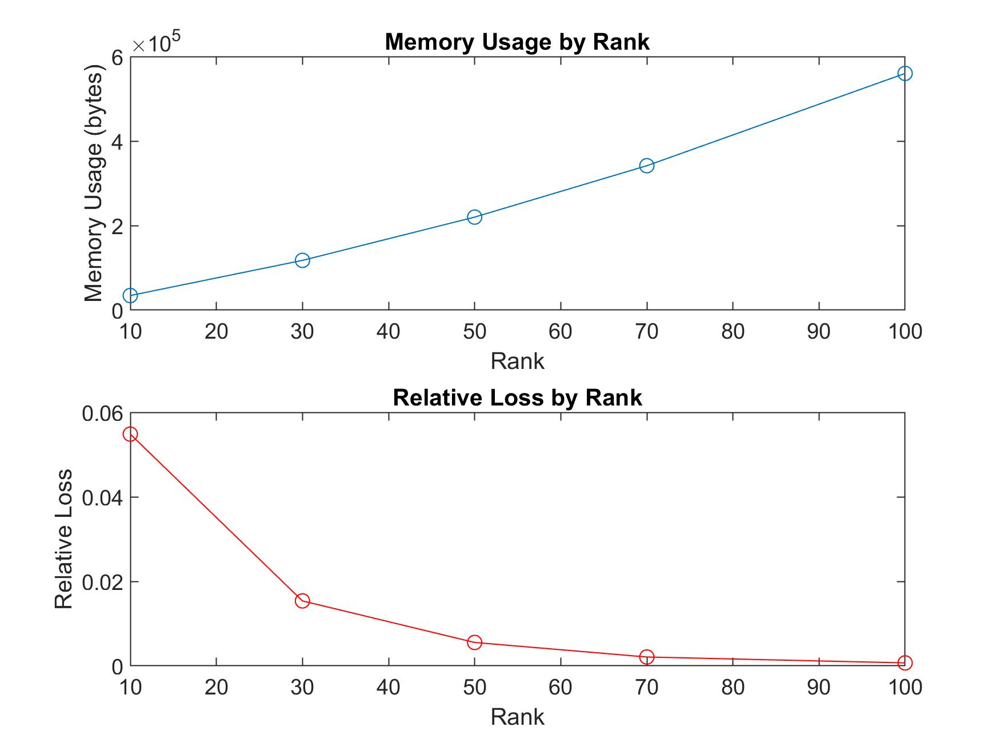
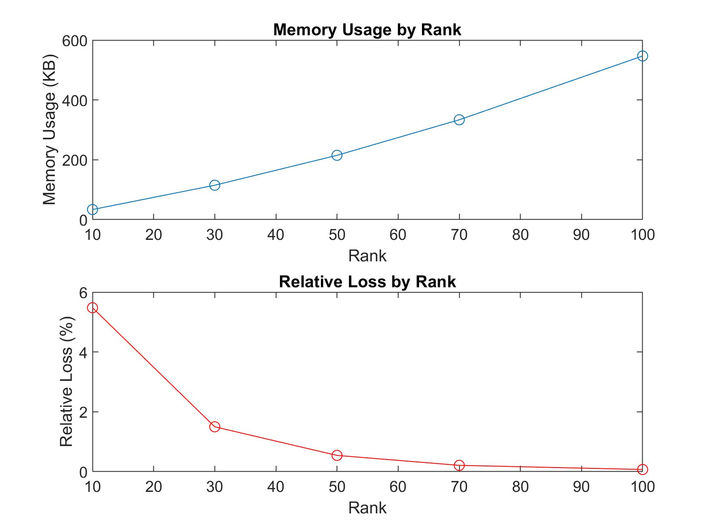

# Tensor Decomposition in MATLAB

## Project Description
This repository houses MATLAB implementations of tensor decomposition algorithms: CP-ALS, HOSVD, and HOOI. These algorithms are crucial for handling multidimensional data in fields like signal processing, computer vision, and data mining, where simplification and analysis of complex datasets are required.

## Algorithms Implemented

- **CP-ALS**: Canonical Polyadic Decomposition using Alternating Least Squares (ALS) focuses on breaking down a tensor into a sum of rank-one tensors.
- **HOSVD**: Higher-Order Singular Value Decomposition provides a robust method for decomposing a tensor into orthogonal matrices and a core tensor, simplifying the tensor structure.
- **HOOI**: Higher-Order Orthogonal Iteration iteratively refines HOSVD to enhance approximation accuracy by optimizing the core tensor and component matrices.

## Usage Instructions

Follow these steps to utilize the tensor decomposition scripts:

1. **Clone the repository**.
2. **Navigate to the repository directory** in MATLAB.
3. **Execute the test scripts** to observe tensor decompositions:
   - `test_CP_ALS.m` for CP-ALS
   - `test_HOSVD.m` for HOSVD
   - `test_HOOI.m` for HOOI
4. **Adapt the test scripts** 

## Visualizing Results
This repository includes images demonstrating the effects of tensor decomposition techniques on the image compression of the University of Limoges logo. Below are the comparisons for each algorithm.

### Image Compression Results Using Tensor Decomposition Techniques
#### CP-ALS Image Reduction
- **Original Image**: Memory = 937.50 KB
- **Compressed Images**:
  - Rank 100, Rank 100, Rank 3: Memory = 546.95 KB, Loss = 0.0710%
  - Rank 50, Rank 50, Rank 3: Memory = 214.91 KB, Loss = 0.5546%
  - Rank 10, Rank 10, Rank 3: Memory = 33.36 KB, Loss = 5.4847%

#### HOOI Image Reduction
- **Original Image**: Memory = 937.50 KB
- **Compressed Images**:
  - Rank 100, Rank 100, Rank 3: Memory = 546.95 KB, Loss = 0.0710%
  - Rank 50, Rank 50, Rank 3: Memory = 214.91 KB, Loss = 0.5546%
  - Rank 10, Rank 10, Rank 3: Memory = 33.36 KB, Loss = 5.4847%

#### HOSVD Image Reduction
- **Original Image**: Memory = 937.50 KB
- **Compressed Images**:
  - Rank 100, Rank 100, Rank 3: Memory = 546.95 KB, Loss = 0.0710%
  - Rank 50, Rank 50, Rank 3: Memory = 214.91 KB, Loss = 0.5546%
  - Rank 10, Rank 10, Rank 3: Memory = 33.36 KB, Loss = 5.4847%

## Compare Algorithms

### CP-ALS Image Reduction

  
   
  <em>Memory usage by rank for CP-ALS.</em>

### HOSVD Image Reduction

  
   
  <em>Memory usage by rank for HOSVD.</em>

### HOOI Image Reduction

  
   
  <em>Memory usage by rank for HOOI.</em>

## File Descriptions

- `*.m`: Implementation scripts for each tensor decomposition algorithm and supporting functions.
- `Introduction-to-Tensors.pdf`: Provides foundational knowledge on tensor theory.
- `Kolda-BaderTensor_decomposition.pdf`: Detailed explanation on tensor decomposition methods.

## References
- Detailed academic references are provided to support the implementations and usage of tensor decomposition algorithms in advanced applications.

For additional details and examples of implementation, refer to the MATLAB scripts and documentation included in this repository.
